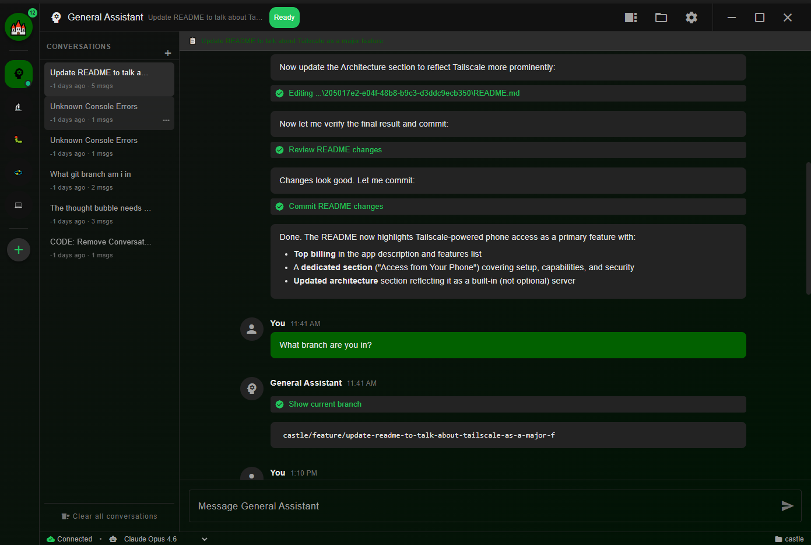
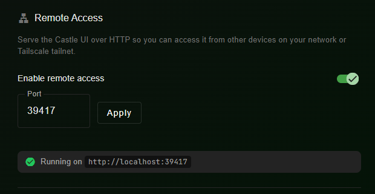

# Castle

A Discord-like desktop application for GitHub Copilot CLI agents. Castle provides a beautiful, intuitive interface for managing multiple AI coding agents, each running its own GitHub Copilot CLI session — accessible from your desktop, phone, or any device on your network.



## Features

- **Use from Your Phone**: Built-in Tailscale-powered web server lets you chat with your agents from any device — phone, tablet, or another computer — right in the browser
- **Multiple Agents**: Run multiple specialized AI agents simultaneously
- **Discord-like UI**: Familiar chat interface with agent circles in the sidebar
- **Project-aware**: Open Castle on any directory, just like VS Code
- **Theme Engine**: Beautiful dark theme with more themes coming
- **Persistent Sessions**: Chat history and permissions are saved via embedded SQLite
- **Permission Control**: Fine-grained control over what agents can do
- **Inter-agent Communication**: Agents can communicate with each other
- **Rich Markdown**: Agent responses rendered with syntax-highlighted code blocks
- **Agent Client Protocol**: ACP SDK integration for standardized agent communication

## Access from Your Phone

Castle includes a built-in web server that lets you interact with your agents from any device on your [Tailscale](https://tailscale.com/) network — no extra apps needed, just a browser.



### How It Works

1. **Enable Tailscale** in Castle's settings
2. Castle starts an HTTP + WebSocket server on port `39417` (configurable)
3. Open your device's browser and navigate to `http://<your-machine-ip>:39417`
4. The full Castle UI loads in your browser with real-time chat streaming

### What You Can Do Remotely

- Chat with all your agents in real time
- View streamed responses and code blocks
- Manage tasks and review agent output
- Everything syncs live between desktop and remote clients

### Security

Remote clients are automatically restricted from sensitive operations like window management, file dialogs, and Tailscale configuration — so your agents stay under your control.

## Installation

### Prerequisites

- Node.js 18+ 
- npm or pnpm
- GitHub Copilot subscription
- GitHub Copilot CLI installed (`npm install -g @github/copilot`)

### Install Dependencies

```bash
npm install
```

### Development

Run the app in development mode:

```bash
npm start
```

This will:
1. Start the Angular development server
2. Launch Electron once the server is ready

### Build

Build for production:

```bash
npm run build
```

This creates distributable packages in the `release/` directory.

## Usage

### Opening a Project

1. Launch Castle
2. Click "Open a Project" or use the menu
3. Select a directory containing your code
4. Castle will discover agents from:
   - Built-in agents (General Assistant, Researcher, Debugger, Git Agent, Primary Coder)
   - Your project's `AGENTS.md` file (if present)

### Chatting with Agents

1. Click an agent circle in the sidebar
2. Type your message in the input area
3. Press Enter to send
4. The agent will respond using GitHub Copilot

### Creating Custom Agents

Add an `AGENTS.md` file to your project root:

```markdown
# My Project Agents

<!-- castle-config
agents:
  - name: My Custom Agent
    icon: "mat:rocket_launch"
    color: "#FF6B6B"
    description: A custom agent for my project
    systemPrompt: |
      You are a specialized assistant for this project.
      Focus on the specific technologies and patterns used here.
-->

## Project Guidelines

- Use TypeScript for all new code
- Follow the existing code style
- Write tests for new features
```

## Built-in Agents

| Agent | Description |
|-------|-------------|
| General Assistant | All-purpose coding help |
| Researcher | Researches tasks and produces detailed analysis documents |
| Debugger | Diagnoses bugs and suggests fixes |
| Git Agent | Helps with Git operations, PRs, commits, and merge conflicts |
| Primary Coder | Primary coding agent for implementation tasks |

## Configuration

Castle stores its configuration in:
- **Windows**: `%APPDATA%/castle/`
- **macOS**: `~/Library/Application Support/castle/`
- **Linux**: `~/.config/castle/`

### Settings

| Setting | Description | Default |
|---------|-------------|---------|
| `theme` | UI theme | `castle-dark` |
| `defaultModel` | AI model to use | `claude-sonnet-4.5` |
| `autoStartAgents` | Auto-start sessions | `false` |
| `showToolCalls` | Show tool call details | `true` |
| `fontSize` | Chat font size | `14` |

## Permissions

Each agent can be granted specific permissions:

| Permission | Description |
|------------|-------------|
| `fileRead` | Read files in workspace |
| `fileWrite` | Write/modify files |
| `fileDelete` | Delete files |
| `executeCommands` | Run shell commands |
| `networkAccess` | Make network requests |
| `gitOperations` | Perform Git operations |

Permissions are requested as needed and can be remembered.

## Architecture

Castle is built with:
- **Electron 29** - Cross-platform desktop framework
- **Angular 17** - Frontend framework (standalone components)
- **Angular Material** - UI components
- **SQL.js** - Embedded SQLite database for persistence
- **Agent Client Protocol SDK** - Standardized agent communication
- **Tailscale Server** - Built-in HTTP + WebSocket server for phone and remote device access
- **marked + highlight.js** - Rich markdown rendering with syntax highlighting
- **GitHub Copilot CLI** - AI backend

See [plans/castle-architecture.md](plans/castle-architecture.md) for detailed architecture documentation.

## Development

### Project Structure

```
castle/
├── src/
│   ├── main/           # Electron main process (IPC, services)
│   ├── preload/        # Electron preload scripts
│   ├── app/            # Angular application (components, services)
│   ├── shared/         # Shared types and constants
│   ├── assets/         # Static assets
│   ├── styles/         # Global stylesheets
│   └── types/          # TypeScript declarations
├── resources/          # App resources (icons, built-in agents.md)
├── plans/              # Architecture documentation
└── release/            # Build output directory
```

### Scripts

| Script | Description |
|--------|-------------|
| `npm start` | Run in development mode |
| `npm run build` | Build for production |
| `npm test` | Run tests |
| `npm run electron:dev` | Run Electron only (no Angular) |

## Contributors

- **[@Porschiey](https://github.com/Porschiey)** — Primary contributor and maintainer

## Contributing

1. Fork the repository
2. Create a feature branch
3. Make your changes
4. Submit a pull request

## License

MIT License

## Acknowledgments

- [GitHub Copilot](https://github.com/features/copilot) for the AI backend
- [AGENTS.md](https://agents.md) for the agent configuration format
- [Discord](https://discord.com) for UI inspiration
