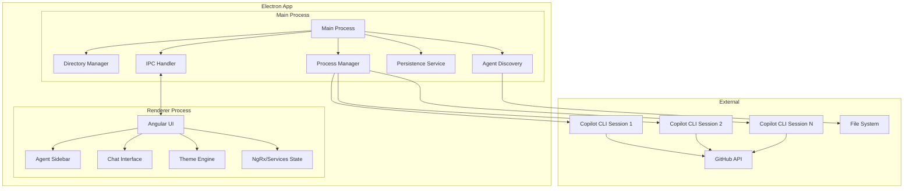
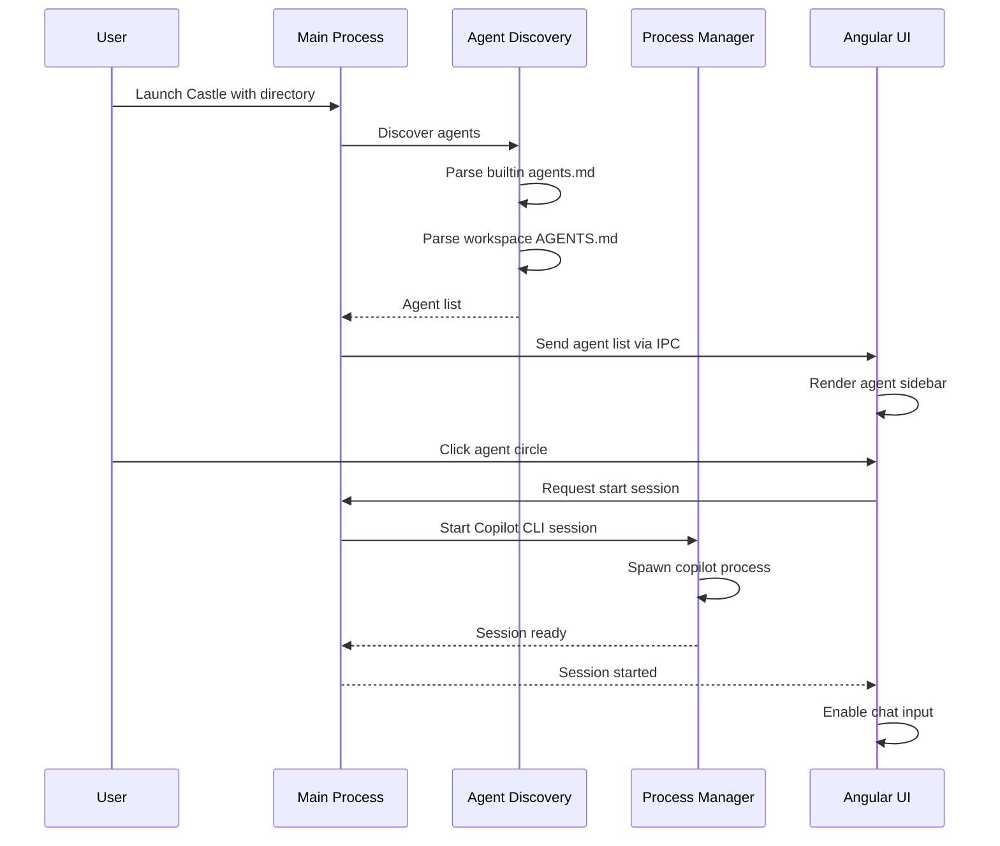
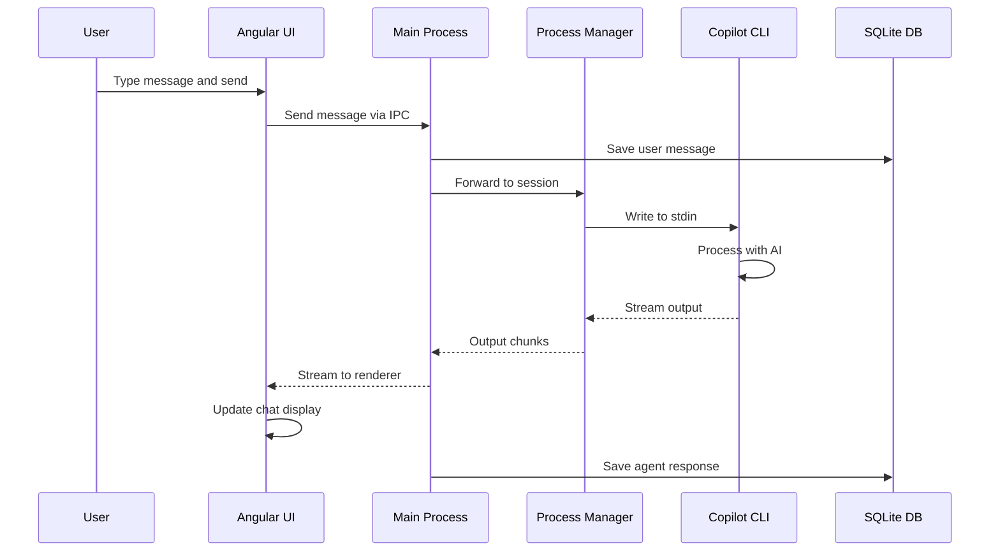
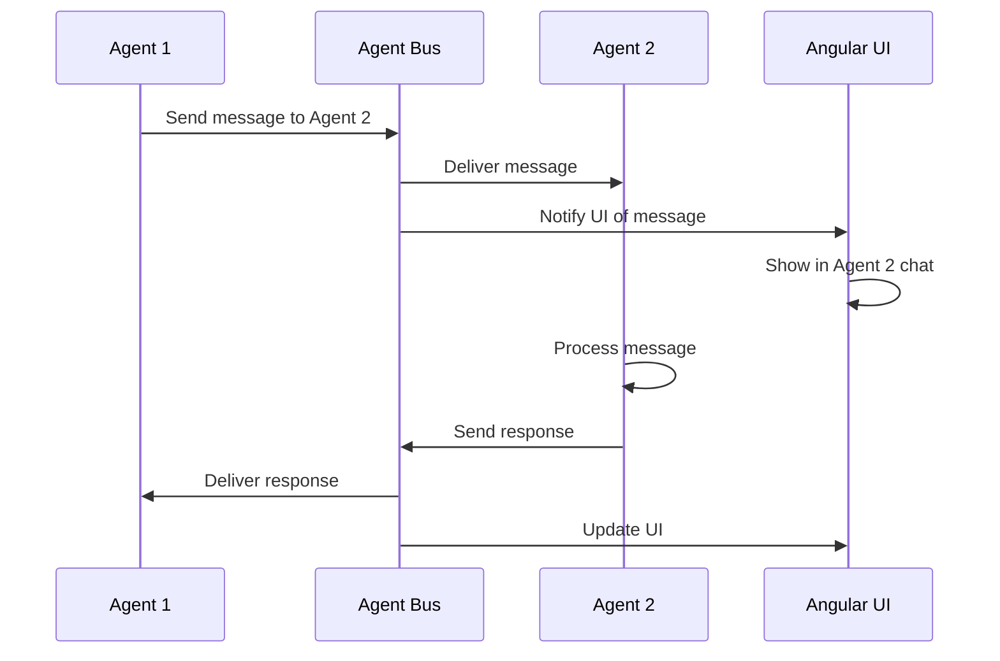

# Castle - GitHub Copilot CLI Desktop App

## Overview

Castle is an Electron-based desktop application that wraps the GitHub Copilot CLI, providing a Discord-like interface for managing multiple AI coding agents. Each agent runs its own Copilot CLI session, and agents can communicate with each other.

## Architecture Diagram



## Technology Stack

| Component | Technology | Rationale |
|-----------|------------|-----------|
| Framework | Electron 28+ | Cross-platform desktop app with Node.js backend |
| Frontend | Angular 17+ with TypeScript | Enterprise-grade framework with built-in DI, routing, and RxJS |
| UI Components | Angular Material | Material Design components with built-in theming and dark mode |
| State Management | Angular Services + RxJS | Built-in reactive state management with BehaviorSubjects |
| Styling | Angular Material Theming + SCSS | Material Design theming system with custom palettes |
| IPC | Electron IPC | Secure communication between processes |
| Process Management | Node.js child_process | Spawn and manage Copilot CLI sessions |
| Persistence | SQLite via better-sqlite3 | Fast, reliable local database for chat history and settings |
| Build Tool | Angular CLI + electron-builder | Standard Angular tooling with Electron packaging |
| Copilot CLI | @github/copilot npm package | Official GitHub Copilot CLI |

## Project Structure

```
castle/
├── package.json
├── electron-builder.json
├── angular.json
├── tsconfig.json
├── tsconfig.app.json
├── tsconfig.electron.json
├── src/
│   ├── main/                      # Electron Main Process
│   │   ├── index.ts               # Main entry point
│   │   ├── window.ts              # Window management
│   │   ├── ipc/                   # IPC handlers
│   │   │   ├── index.ts
│   │   │   ├── agents.ipc.ts
│   │   │   ├── chat.ipc.ts
│   │   │   └── settings.ipc.ts
│   │   ├── services/
│   │   │   ├── agent-discovery.service.ts
│   │   │   ├── process-manager.service.ts
│   │   │   ├── database.service.ts
│   │   │   └── directory.service.ts
│   │   └── utils/
│   │       ├── logger.ts
│   │       └── paths.ts
│   │
│   ├── app/                       # Angular Application
│   │   ├── app.component.ts
│   │   ├── app.component.html
│   │   ├── app.component.scss
│   │   ├── app.config.ts
│   │   ├── app.routes.ts
│   │   ├── core/                  # Core module
│   │   │   ├── services/
│   │   │   │   ├── electron.service.ts
│   │   │   │   ├── agent.service.ts
│   │   │   │   ├── chat.service.ts
│   │   │   │   ├── theme.service.ts
│   │   │   │   └── settings.service.ts
│   │   │   ├── models/
│   │   │   │   ├── agent.model.ts
│   │   │   │   ├── message.model.ts
│   │   │   │   ├── settings.model.ts
│   │   │   │   └── permission.model.ts
│   │   │   └── guards/
│   │   │       └── electron.guard.ts
│   │   │
│   │   ├── features/              # Feature modules
│   │   │   ├── sidebar/
│   │   │   │   ├── sidebar.component.ts
│   │   │   │   ├── sidebar.component.html
│   │   │   │   ├── sidebar.component.scss
│   │   │   │   ├── agent-circle/
│   │   │   │   │   ├── agent-circle.component.ts
│   │   │   │   │   ├── agent-circle.component.html
│   │   │   │   │   └── agent-circle.component.scss
│   │   │   │   └── sidebar.module.ts
│   │   │   │
│   │   │   ├── chat/
│   │   │   │   ├── chat.component.ts
│   │   │   │   ├── chat.component.html
│   │   │   │   ├── chat.component.scss
│   │   │   │   ├── message-list/
│   │   │   │   │   ├── message-list.component.ts
│   │   │   │   │   └── message-list.component.html
│   │   │   │   ├── message-bubble/
│   │   │   │   │   ├── message-bubble.component.ts
│   │   │   │   │   ├── message-bubble.component.html
│   │   │   │   │   └── message-bubble.component.scss
│   │   │   │   ├── code-block/
│   │   │   │   │   ├── code-block.component.ts
│   │   │   │   │   └── code-block.component.scss
│   │   │   │   ├── chat-input/
│   │   │   │   │   ├── chat-input.component.ts
│   │   │   │   │   └── chat-input.component.html
│   │   │   │   └── chat.module.ts
│   │   │   │
│   │   │   └── settings/
│   │   │       ├── settings.component.ts
│   │   │       ├── permissions/
│   │   │       │   └── permissions.component.ts
│   │   │       ├── themes/
│   │   │       │   └── themes.component.ts
│   │   │       └── settings.module.ts
│   │   │
│   │   ├── shared/                # Shared module
│   │   │   ├── components/
│   │   │   │   ├── toolbar/
│   │   │   │   ├── status-bar/
│   │   │   │   └── confirm-dialog/
│   │   │   ├── pipes/
│   │   │   │   ├── time-ago.pipe.ts
│   │   │   │   └── highlight.pipe.ts
│   │   │   ├── directives/
│   │   │   │   └── auto-scroll.directive.ts
│   │   │   └── shared.module.ts
│   │   │
│   │   └── layout/
│   │       ├── main-layout.component.ts
│   │       ├── main-layout.component.html
│   │       └── main-layout.component.scss
│   │
│   ├── assets/
│   │   ├── icons/
│   │   └── i18n/
│   │
│   ├── styles/
│   │   ├── styles.scss            # Global styles
│   │   ├── _variables.scss        # SCSS variables
│   │   ├── _themes.scss           # Theme definitions
│   │   └── _material-overrides.scss
│   │
│   ├── environments/
│   │   ├── environment.ts
│   │   └── environment.prod.ts
│   │
│   ├── index.html
│   ├── main.ts                    # Angular bootstrap
│   └── polyfills.ts
│   │
│   ├── preload/                   # Electron Preload Scripts
│   │   └── index.ts
│   │
│   └── shared/                    # Shared types between main and renderer
│       ├── types/
│       │   ├── agent.types.ts
│       │   ├── message.types.ts
│       │   ├── settings.types.ts
│       │   └── ipc.types.ts
│       └── constants.ts
│
├── resources/                     # App resources
│   ├── icons/
│   ├── agents.md                  # Built-in agents
│   └── migrations/                # SQLite migrations
│
└── data/                          # Runtime data (gitignored)
    ├── castle.db                  # SQLite database
    └── logs/
```

## Core Components

### 1. Agent Discovery Service

Responsible for finding and parsing AGENTS.md files from:
1. App's internal `resources/agents.md`
2. Opened directory's `AGENTS.md` or `agents.md`

```typescript
// src/shared/types/agent.types.ts
export interface Agent {
  id: string;
  name: string;
  description: string;
  icon?: string;           // URL or emoji
  color?: string;          // Accent color for the circle
  systemPrompt?: string;   // Custom instructions for this agent
  source: 'builtin' | 'workspace';
  capabilities?: string[];
  mcpServers?: MCPServerConfig[];
}

export interface AgentDiscoveryResult {
  builtinAgents: Agent[];
  workspaceAgents: Agent[];
  combined: Agent[];
}
```

### 2. Process Manager

Manages Copilot CLI child processes for each agent session.

```typescript
// src/shared/types/session.types.ts
export interface CopilotSession {
  id: string;
  agentId: string;
  process: ChildProcess;
  workingDirectory: string;
  status: 'starting' | 'ready' | 'busy' | 'error' | 'stopped';
  permissions: PermissionSet;
}

// src/main/services/process-manager.service.ts
export interface ProcessManager {
  startSession(agent: Agent, workDir: string): Promise<CopilotSession>;
  stopSession(sessionId: string): Promise<void>;
  sendMessage(sessionId: string, message: string): Promise<void>;
  onOutput(sessionId: string, callback: OutputCallback): void;
  getSession(sessionId: string): CopilotSession | undefined;
}
```

### 3. Inter-Agent Communication

Agents can communicate via a message bus system.

```typescript
// src/shared/types/agent-bus.types.ts
export interface AgentMessage {
  id: string;
  fromAgentId: string;
  toAgentId: string | 'broadcast';
  content: string;
  timestamp: Date;
  type: 'request' | 'response' | 'notification';
}

export interface AgentBus {
  send(message: AgentMessage): Promise<void>;
  subscribe(agentId: string, callback: MessageCallback): void;
  unsubscribe(agentId: string): void;
}
```

### 4. Database Service (SQLite)

SQLite database for storing:
- Chat history per agent
- User preferences
- Permission grants
- Theme settings

```typescript
// src/main/services/database.service.ts
export interface DatabaseService {
  // Initialization
  initialize(): Promise<void>;
  runMigrations(): Promise<void>;
  
  // Chat history
  saveMessage(agentId: string, message: ChatMessage): Promise<void>;
  getMessages(agentId: string, limit?: number, offset?: number): Promise<ChatMessage[]>;
  searchMessages(agentId: string, query: string): Promise<ChatMessage[]>;
  clearHistory(agentId: string): Promise<void>;
  
  // Permissions
  getPermissions(agentId: string): Promise<PermissionSet>;
  setPermission(agentId: string, permission: Permission, granted: boolean): Promise<void>;
  
  // Settings
  getSettings(): Promise<AppSettings>;
  updateSettings(settings: Partial<AppSettings>): Promise<void>;
  
  // Recent directories
  addRecentDirectory(path: string): Promise<void>;
  getRecentDirectories(): Promise<string[]>;
}
```

**Database Schema:**

```sql
-- agents table
CREATE TABLE agents (
  id TEXT PRIMARY KEY,
  name TEXT NOT NULL,
  description TEXT,
  icon TEXT,
  color TEXT,
  system_prompt TEXT,
  source TEXT NOT NULL,
  created_at DATETIME DEFAULT CURRENT_TIMESTAMP
);

-- messages table
CREATE TABLE messages (
  id TEXT PRIMARY KEY,
  agent_id TEXT NOT NULL,
  role TEXT NOT NULL, -- 'user' | 'assistant' | 'system'
  content TEXT NOT NULL,
  metadata TEXT, -- JSON for tool calls, etc.
  created_at DATETIME DEFAULT CURRENT_TIMESTAMP,
  FOREIGN KEY (agent_id) REFERENCES agents(id)
);

-- permissions table
CREATE TABLE permissions (
  id INTEGER PRIMARY KEY AUTOINCREMENT,
  agent_id TEXT NOT NULL,
  permission_type TEXT NOT NULL,
  granted BOOLEAN NOT NULL DEFAULT 0,
  updated_at DATETIME DEFAULT CURRENT_TIMESTAMP,
  UNIQUE(agent_id, permission_type)
);

-- settings table
CREATE TABLE settings (
  key TEXT PRIMARY KEY,
  value TEXT NOT NULL,
  updated_at DATETIME DEFAULT CURRENT_TIMESTAMP
);

-- recent_directories table
CREATE TABLE recent_directories (
  id INTEGER PRIMARY KEY AUTOINCREMENT,
  path TEXT NOT NULL UNIQUE,
  last_opened DATETIME DEFAULT CURRENT_TIMESTAMP
);

-- Create indexes
CREATE INDEX idx_messages_agent_id ON messages(agent_id);
CREATE INDEX idx_messages_created_at ON messages(created_at);
CREATE INDEX idx_permissions_agent_id ON permissions(agent_id);
```

### 5. Angular Material Theme Engine

Using Angular Material's theming system with custom palettes.

```typescript
// src/app/core/services/theme.service.ts
import { Injectable, signal } from '@angular/core';

export type ThemeMode = 'light' | 'dark';

export interface CastleTheme {
  id: string;
  name: string;
  mode: ThemeMode;
  primary: string;    // Primary palette color
  accent: string;     // Accent palette color
  warn: string;       // Warn palette color
}

@Injectable({ providedIn: 'root' })
export class ThemeService {
  private readonly THEME_KEY = 'castle-theme';
  
  currentTheme = signal<CastleTheme>(this.getDefaultTheme());
  
  readonly availableThemes: CastleTheme[] = [
    {
      id: 'castle-dark',
      name: 'Castle Dark',
      mode: 'dark',
      primary: '#7C3AED',  // Purple
      accent: '#10B981',   // Green
      warn: '#EF4444'      // Red
    },
    {
      id: 'castle-light',
      name: 'Castle Light',
      mode: 'light',
      primary: '#6366F1',  // Indigo
      accent: '#14B8A6',   // Teal
      warn: '#F59E0B'      // Amber
    },
    {
      id: 'midnight',
      name: 'Midnight',
      mode: 'dark',
      primary: '#3B82F6',  // Blue
      accent: '#EC4899',   // Pink
      warn: '#F97316'      // Orange
    }
  ];
  
  setTheme(themeId: string): void { /* ... */ }
  private getDefaultTheme(): CastleTheme { /* ... */ }
}
```

**SCSS Theme Setup:**

```scss
// src/styles/_themes.scss
@use '@angular/material' as mat;

// Define custom palettes
$castle-purple-palette: (
  50: #f5f3ff,
  100: #ede9fe,
  // ... full palette
  500: #7c3aed,
  // ...
  contrast: (
    50: rgba(black, 0.87),
    // ...
  )
);

// Dark theme
$castle-dark-theme: mat.define-dark-theme((
  color: (
    primary: mat.define-palette($castle-purple-palette),
    accent: mat.define-palette(mat.$green-palette),
    warn: mat.define-palette(mat.$red-palette),
  ),
  typography: mat.define-typography-config(),
  density: 0,
));

// Apply theme
.castle-dark {
  @include mat.all-component-themes($castle-dark-theme);
  
  // Custom CSS variables for non-Material components
  --bg-primary: #1a1a2e;
  --bg-secondary: #16213e;
  --bg-tertiary: #0f3460;
  --text-primary: #ffffff;
  --text-secondary: #a0aec0;
  --border-color: #2d3748;
  --user-bubble: #7c3aed;
  --agent-bubble: #2d3748;
  --code-bg: #1e1e1e;
}
```

## UI Layout

```
┌─────────────────────────────────────────────────────────────────┐
│  Castle - ~/projects/my-app                              [─][□][×]│
├────┬────────────────────────────────────────────────────────────┤
│    │  ┌─────────────────────────────────────────────────────┐   │
│ ●  │  │ Agent Name                                    ⚙️    │   │
│    │  ├─────────────────────────────────────────────────────┤   │
│ ●  │  │                                                     │   │
│    │  │  ┌──────────────────────────────────────────────┐  │   │
│ ●  │  │  │ User message bubble                          │  │   │
│    │  │  └──────────────────────────────────────────────┘  │   │
│ ●  │  │                                                     │   │
│    │  │  ┌──────────────────────────────────────────────┐  │   │
│ ─  │  │  │ Agent response with code:                    │  │   │
│    │  │  │ ```typescript                                │  │   │
│ +  │  │  │ const x = 1;                                 │  │   │
│    │  │  │ ```                                          │  │   │
│    │  │  │ [Tool: read_file] ✓                          │  │   │
│    │  │  └──────────────────────────────────────────────┘  │   │
│    │  │                                                     │   │
│    │  ├─────────────────────────────────────────────────────┤   │
│    │  │ ┌─────────────────────────────────────────┐ [Send] │   │
│    │  │ │ Type a message...                       │        │   │
│    │  │ └─────────────────────────────────────────┘        │   │
│    │  └─────────────────────────────────────────────────────┘   │
├────┴────────────────────────────────────────────────────────────┤
│  Status: Connected to GitHub • Model: Claude Sonnet 4.5         │
└─────────────────────────────────────────────────────────────────┘

Legend:
● = Agent circle (colored, shows status via mat-badge)
─ = mat-divider
+ = mat-fab mini button to add agent
```

## Angular Components Structure

### Main Layout Component
```typescript
// src/app/layout/main-layout.component.ts
@Component({
  selector: 'app-main-layout',
  template: `
    <mat-sidenav-container class="app-container">
      <mat-sidenav mode="side" opened class="agent-sidebar">
        <app-sidebar />
      </mat-sidenav>
      
      <mat-sidenav-content class="main-content">
        <app-toolbar />
        <app-chat [agent]="selectedAgent()" />
        <app-status-bar />
      </mat-sidenav-content>
    </mat-sidenav-container>
  `
})
export class MainLayoutComponent {
  selectedAgent = inject(AgentService).selectedAgent;
}
```

### Agent Circle Component
```typescript
// src/app/features/sidebar/agent-circle/agent-circle.component.ts
@Component({
  selector: 'app-agent-circle',
  template: `
    <button 
      mat-fab 
      [color]="isSelected() ? 'primary' : 'basic'"
      [matTooltip]="agent().name"
      matTooltipPosition="right"
      [matBadge]="unreadCount()"
      [matBadgeHidden]="unreadCount() === 0"
      matBadgeColor="accent"
      (click)="onSelect()">
      @if (agent().icon) {
        <span class="agent-icon">{{ agent().icon }}</span>
      } @else {
        <mat-icon>smart_toy</mat-icon>
      }
    </button>
  `,
  styles: [`
    :host {
      display: block;
      margin: 8px 0;
    }
    .agent-icon {
      font-size: 24px;
    }
  `]
})
export class AgentCircleComponent {
  agent = input.required<Agent>();
  isSelected = input<boolean>(false);
  unreadCount = input<number>(0);
  
  selected = output<Agent>();
  
  onSelect() {
    this.selected.emit(this.agent());
  }
}
```

### Chat Input Component
```typescript
// src/app/features/chat/chat-input/chat-input.component.ts
@Component({
  selector: 'app-chat-input',
  template: `
    <mat-form-field appearance="outline" class="chat-input-field">
      <mat-label>Message {{ agentName() }}</mat-label>
      <textarea 
        matInput
        [(ngModel)]="message"
        (keydown.enter)="onSend($event)"
        [disabled]="isLoading()"
        cdkTextareaAutosize
        cdkAutosizeMinRows="1"
        cdkAutosizeMaxRows="5"
        placeholder="Type a message or use / for commands...">
      </textarea>
      <button 
        mat-icon-button 
        matSuffix 
        (click)="onSend()"
        [disabled]="!message.trim() || isLoading()">
        <mat-icon>send</mat-icon>
      </button>
    </mat-form-field>
  `
})
export class ChatInputComponent {
  agentName = input<string>('');
  isLoading = input<boolean>(false);
  
  messageSent = output<string>();
  
  message = '';
  
  onSend(event?: KeyboardEvent) {
    if (event && !event.shiftKey) {
      event.preventDefault();
    }
    if (this.message.trim()) {
      this.messageSent.emit(this.message);
      this.message = '';
    }
  }
}
```

## Data Flow

### Starting the App



### Sending a Message



### Inter-Agent Communication



## AGENTS.md Format for Castle

Castle extends the standard AGENTS.md format with additional metadata:

```markdown
# AGENTS.md

## Castle Configuration

<!-- castle-config
agents:
  - name: Code Assistant
    icon: 🤖
    color: "#7C3AED"
    description: General purpose coding assistant
    
  - name: Test Writer
    icon: 🧪
    color: "#10B981"
    description: Specialized in writing tests
    systemPrompt: |
      You are a test writing specialist. Focus on:
      - Unit tests with high coverage
      - Integration tests
      - E2E tests when appropriate
      
  - name: Reviewer
    icon: 👀
    color: "#F59E0B"
    description: Code review specialist
    systemPrompt: |
      You are a code reviewer. Focus on:
      - Code quality and best practices
      - Security vulnerabilities
      - Performance issues
-->

## Dev environment tips
- Use `pnpm` for package management
- Run `pnpm dev` to start development server

## Testing instructions
- Run `pnpm test` for unit tests
- Run `pnpm e2e` for end-to-end tests
```

## Permission System

Permissions are granted per-agent and persisted in SQLite:

```typescript
// src/shared/types/permission.types.ts
export interface PermissionSet {
  fileRead: boolean;      // Read files in workspace
  fileWrite: boolean;     // Write/modify files
  fileDelete: boolean;    // Delete files
  executeCommands: boolean; // Run shell commands
  networkAccess: boolean; // Make network requests
  gitOperations: boolean; // Git commands
}

export interface PermissionRequest {
  agentId: string;
  permission: keyof PermissionSet;
  context: string;        // Why the permission is needed
  timestamp: Date;
}
```

### Permission Dialog Component
```typescript
// src/app/shared/components/permission-dialog/permission-dialog.component.ts
@Component({
  selector: 'app-permission-dialog',
  template: `
    <h2 mat-dialog-title>Permission Request</h2>
    <mat-dialog-content>
      <p><strong>{{ data.agentName }}</strong> is requesting permission to:</p>
      <p class="permission-type">{{ getPermissionLabel(data.permission) }}</p>
      <p class="context">{{ data.context }}</p>
      <mat-checkbox [(ngModel)]="rememberChoice">
        Remember this choice
      </mat-checkbox>
    </mat-dialog-content>
    <mat-dialog-actions align="end">
      <button mat-button [mat-dialog-close]="{ granted: false, remember: rememberChoice }">
        Deny
      </button>
      <button mat-raised-button color="primary" 
              [mat-dialog-close]="{ granted: true, remember: rememberChoice }">
        Allow
      </button>
    </mat-dialog-actions>
  `
})
export class PermissionDialogComponent {
  data = inject(MAT_DIALOG_DATA);
  rememberChoice = true;
}
```

## Security Considerations

1. **Process Isolation**: Each Copilot CLI session runs in its own child process
2. **Permission Prompts**: Dangerous operations require explicit user approval
3. **Workspace Sandboxing**: Agents can only access files within the opened directory
4. **Token Security**: GitHub tokens stored securely using electron-store with encryption
5. **IPC Validation**: All IPC messages validated before processing
6. **Context Isolation**: Renderer process runs with contextIsolation enabled
7. **CSP Headers**: Content Security Policy to prevent XSS attacks

## Development Phases

### Phase 1: Foundation
- Set up Electron + Angular project structure
- Configure Angular Material with dark theme
- Implement basic window management
- Create directory selection flow
- Set up IPC communication

### Phase 2: Agent System
- Implement AGENTS.md parser
- Create agent discovery service
- Build agent sidebar with Material components
- Implement Copilot CLI process spawning

### Phase 3: Chat Interface
- Build message list with virtual scrolling (cdk-virtual-scroll)
- Implement code block rendering with syntax highlighting
- Create chat input with Material form field
- Add streaming message support with RxJS

### Phase 4: Persistence & Permissions
- Set up SQLite database with migrations
- Implement chat history storage
- Create permission management dialog
- Add permission persistence

### Phase 5: Theme Engine
- Configure Angular Material theming
- Implement theme switching
- Create custom theme variables
- Add theme persistence

### Phase 6: Inter-Agent Communication
- Implement agent message bus
- Add cross-agent messaging UI
- Create agent mention system (@agent syntax)

### Phase 7: Polish & Packaging
- Add error handling and recovery
- Implement logging with electron-log
- Create installer packages for Windows/Mac/Linux
- Write documentation

## Built-in Agents

Castle ships with these default agents in `resources/agents.md`:

1. **General Assistant** 🤖 - All-purpose coding help
2. **Code Reviewer** 👀 - Reviews code for issues
3. **Test Writer** 🧪 - Writes tests for your code
4. **Documentation** 📝 - Writes and updates docs
5. **Refactorer** ♻️ - Improves code structure

## Configuration Files

### `~/.castle/config.json`
```json
{
  "theme": "castle-dark",
  "defaultModel": "claude-sonnet-4.5",
  "autoStartAgents": false,
  "showToolCalls": true,
  "fontSize": 14,
  "recentDirectories": []
}
```

## Angular Material Modules Used

The app will use these Angular Material components:

- **Layout**: `MatSidenavModule`, `MatToolbarModule`
- **Buttons**: `MatButtonModule`, `MatIconModule`, `MatFabModule`
- **Forms**: `MatFormFieldModule`, `MatInputModule`
- **Feedback**: `MatSnackBarModule`, `MatProgressSpinnerModule`, `MatBadgeModule`
- **Dialogs**: `MatDialogModule`
- **Navigation**: `MatTooltipModule`, `MatMenuModule`
- **Data Display**: `MatListModule`, `MatDividerModule`
- **Selection**: `MatCheckboxModule`, `MatSlideToggleModule`

## Key Dependencies

```json
{
  "dependencies": {
    "@angular/animations": "^17.0.0",
    "@angular/cdk": "^17.0.0",
    "@angular/common": "^17.0.0",
    "@angular/compiler": "^17.0.0",
    "@angular/core": "^17.0.0",
    "@angular/forms": "^17.0.0",
    "@angular/material": "^17.0.0",
    "@angular/platform-browser": "^17.0.0",
    "@angular/platform-browser-dynamic": "^17.0.0",
    "@angular/router": "^17.0.0",
    "@github/copilot": "latest",
    "better-sqlite3": "^9.0.0",
    "electron-store": "^8.0.0",
    "highlight.js": "^11.0.0",
    "marked": "^11.0.0",
    "rxjs": "^7.8.0",
    "zone.js": "^0.14.0"
  },
  "devDependencies": {
    "@angular-devkit/build-angular": "^17.0.0",
    "@angular/cli": "^17.0.0",
    "@angular/compiler-cli": "^17.0.0",
    "@types/better-sqlite3": "^7.0.0",
    "electron": "^28.0.0",
    "electron-builder": "^24.0.0",
    "typescript": "^5.2.0"
  }
}
```

## Next Steps

1. Review and approve this architecture plan
2. Switch to Code mode to begin implementation
3. Start with Phase 1: Foundation setup (Electron + Angular + Material)
